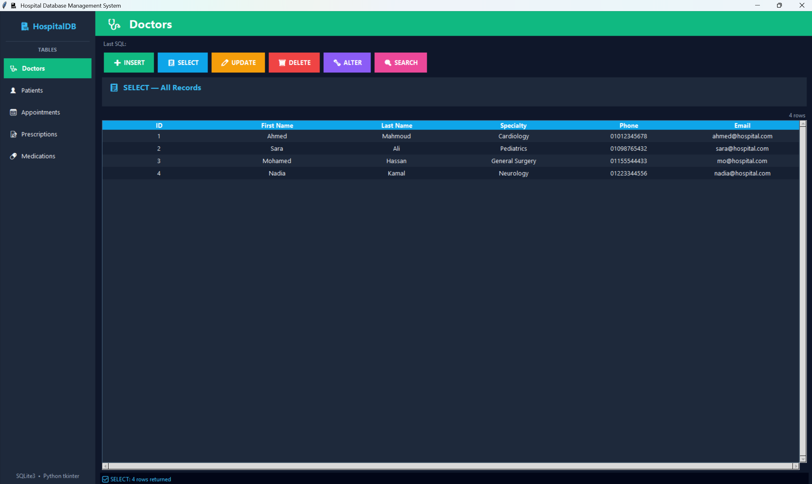
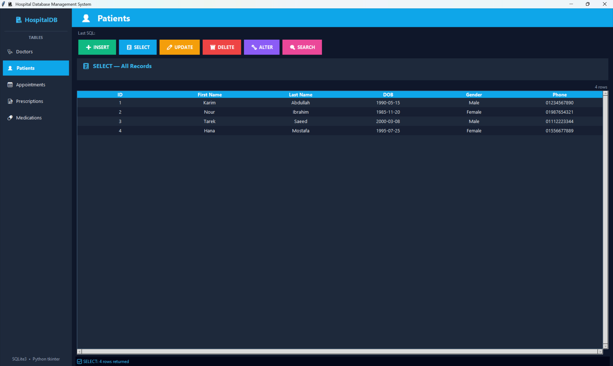
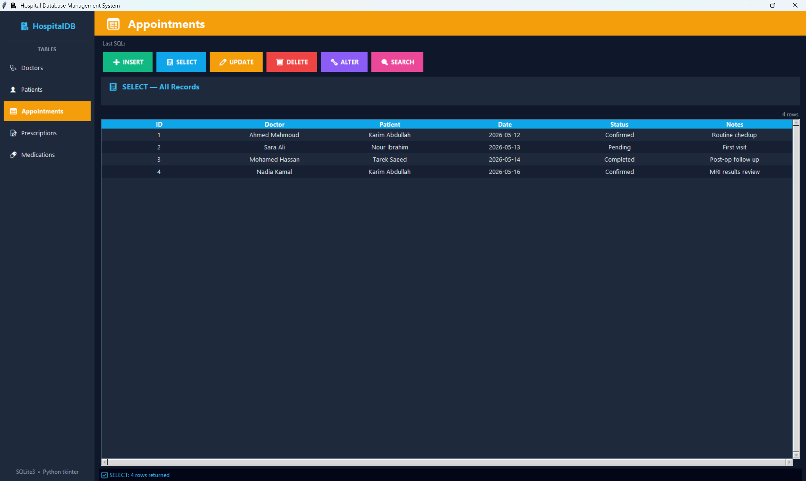
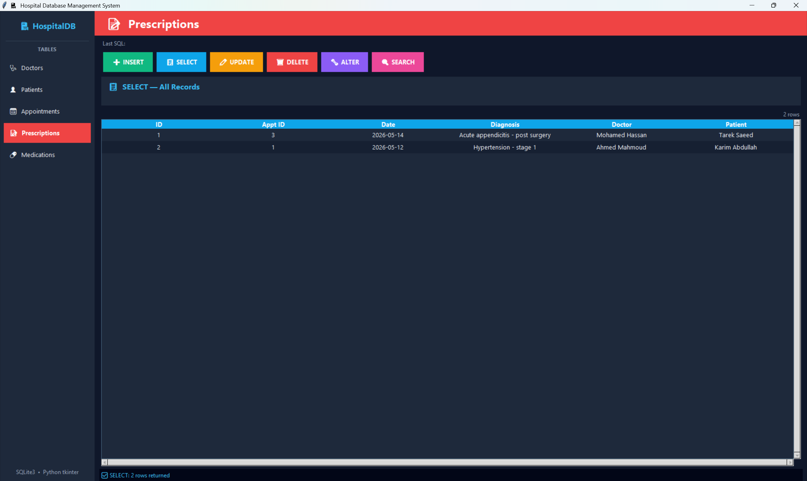
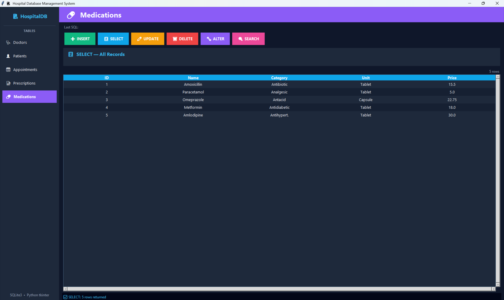

# 🏥 Hospital Management System

A modern desktop application for managing hospital records using **Python**, **Tkinter**, and **SQLite**.

---

## 📖 About

The Hospital Management System is a desktop application that simplifies hospital data management through an intuitive graphical interface. It allows users to perform complete CRUD operations while storing data securely in an SQLite database.

---

## ✨ Features

* 👨‍⚕️ Doctors Management
* 👤 Patients Management
* 📅 Appointments Management
* 📝 Prescriptions Management
* 💊 Medications Management
* ➕ Insert Records
* 📋 Display Records
* ✏️ Update Records
* 🗑 Delete Records
* 🔍 Search Records
* 🗄 SQLite Database Support
* 🖥 Modern Tkinter Interface

---

## 🛠 Built With

* Python 3
* Tkinter
* SQLite3

---

## 📂 Project Structure

```text
Hospital-Management-System/
│
├── screenshots/
│   ├── home.png
│   ├── patients.png
│   ├── appointments.png
│   ├── prescriptions.png
│   └── medications.png
│
├── hospital_gui.py
├── hospital_db.sql
├── hospital.db
├── README.md
└── .gitignore
```

---

## 🚀 Getting Started

Clone the repository

```bash
git clone https://github.com/ahmed-elzny/Hospital-Management-System.git
```

Open the project

```bash
cd Hospital-Management-System
```

Run the application

```bash
python hospital_gui.py
```

---

# 📸 Application Preview

## 🏠 Home



---

## 👤 Patients



---

## 📅 Appointments



---

## 📝 Prescriptions



---

## 💊 Medications



---

## 🗄 Database

SQLite is used as the backend database.

Database schema:

```text
hospital_db.sql
```

---

## 👨‍💻 Developer

**Ahmed Elzny**

GitHub: https://github.com/ahmed-elzny

---

⭐ If you found this project useful, consider giving it a star.
